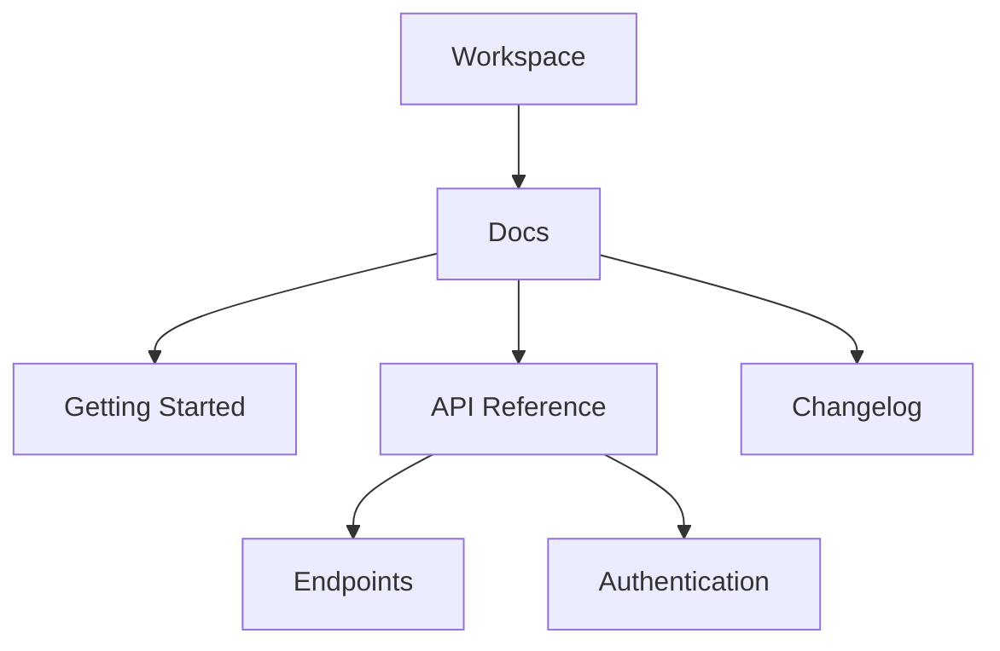

## Overview

VideoGraph provides powerful tools to manage your project documentation efficiently. You organize content into intuitive hierarchies, search through documents quickly, track changes with version control, and collaborate seamlessly with your team. These core features ensure your docs stay current and accessible.

<Columns cols={2}>
  <Card title="Organize Hierarchies" icon="folder-tree" href="#document-organization">
    Build nested structures for your docs.
  </Card>
  <Card title="Advanced Search" icon="search" href="#search-filtering">
    Find content instantly with filters.
  </Card>
  <Card title="Version Control" icon="git-branch" href="#version-control">
    Track and revert changes easily.
  </Card>
  <Card title="Team Collaboration" icon="users" href="#collaboration">
    Share and edit docs together.
  </Card>
</Columns>

## Document Organization and Hierarchy

Create a clear structure for your documentation using folders and pages. VideoGraph supports unlimited nesting, so you build complex hierarchies like `/docs/guides/advanced/api-reference`.



<Steps>
  <Step title="Create Folder" icon="folder-plus">
    Navigate to your workspace and select `New Folder`.
  </Step>
  <Step title="Add Pages" icon="file-plus">
    Inside folders, create pages with rich text, code blocks, and embeds.
  </Step>
  <Step title="Nest Content" icon="chevron-down">
    Drag and drop to reorganize your hierarchy.
  </Step>
</Steps>

<Callout kind="tip">
  Use keyboard shortcuts like <kbd>Cmd</kbd>+<kbd>K</kbd> to jump to any page in your hierarchy.
</Callout>

## Search and Filtering Options

VideoGraph's search scans titles, content, and metadata. Filter by tags, authors, or dates for precise results.

<Tabs>
  <Tab title="Basic Search" icon="search">
    Type keywords to find matches across your workspace.

    ```
    video editing workflow
    ```
  </Tab>
  <Tab title="Advanced Filters" icon="filter">
    Combine filters: `tag:api updated>2024-01-01 author:team`.

    <Expandable title="Filter Syntax" default-open="true">
      - `tag:{name}` matches tagged docs
      - `updated>{date}` shows recent changes
      - `author:{user}` limits by creator
    </Expandable>
  </Tab>
  <Tab title="Saved Searches" icon="bookmark">
    Pin frequent queries for quick access.
  </Tab>
</Tabs>

## Version Control for Docs

Track every change with built-in version history. You compare diffs, restore previous versions, or branch for experiments.

<CodeGroup tabs="CLI,API">
  ```bash
  # Fetch history
  videograph history --doc-id=123

  # Restore version
  videograph restore --doc-id=123 --version=v2.1
  ```
  ```javascript
  // API example
  const history = await fetch('https://api.example.com/docs/123/history');
  const versions = await history.json();

  // Restore specific version
  await fetch('https://api.example.com/docs/123/restore', {
    method: 'POST',
    body: JSON.stringify({ version: 'v2.1' })
  });
  ```
</CodeGroup>

| Action | CLI Command | API Endpoint |
|--------|-------------|--------------|
| View history | `videograph history --id=123` | `GET /docs/{id}/history` |
| Compare versions | `videograph diff --id=123 --v1=v1.0 --v2=v2.0` | `POST /docs/{id}/diff` |
| Restore | `videograph restore --id=123 --version=v2.1` | `POST /docs/{id}/restore` |

## Collaboration and Sharing Features

Invite team members to edit docs in real-time. Share public links or embed pages in your apps.

<Callout kind="info">
  Real-time cursors show who edits what, reducing conflicts.
</Callout>

<Steps>
  <Step title="Invite Collaborators" icon="user-plus">
    Go to `Share` > `Invite` and add emails or workspace users.
  </Step>
  <Step title="Set Permissions" icon="shield">
    Choose roles: Viewer, Editor, Admin.
  </Step>
  <Step title="Publish Links" icon="globe">
    Generate public URLs with optional passwords.
  </Step>
</Steps>

<Expandable title="Advanced Permissions" default-open="false">
  Use granular controls like `edit:publish` or `comment:only` for fine-tuned access.
</Expandable>

These features make VideoGraph your go-to for scalable documentation. Start organizing your project docs today.